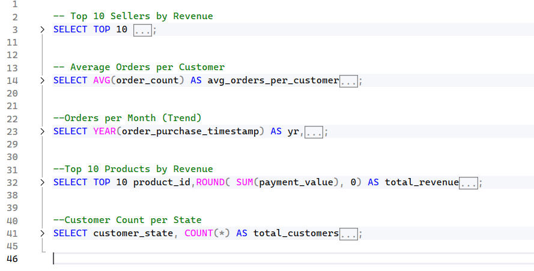
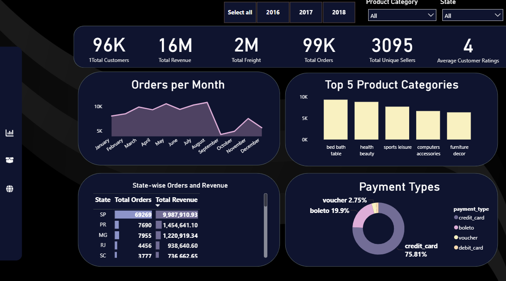
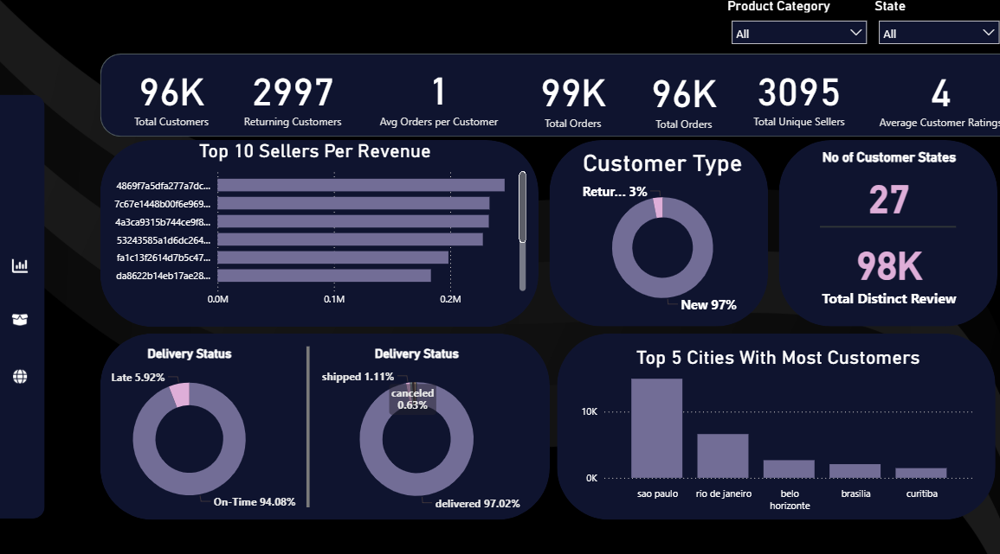

# Olist E-commerce Case Study

## Overview
This repository contains the data analysis and visualizations for the Olist E-commerce Case Study. The analysis focuses on Brazilian e-commerce operations, including sales trends, top sellers, customer behavior, and product insights.

## Dataset
The project uses the Brazilian E-commerce dataset from Olist, which includes the following tables:

- `orders` – Order details
- `order_items` – Items in each order
- `customers` – Customer information
- `products` – Product details
- `sellers` – Seller information
- `payments` – Payment transactions
- `reviews` – Customer reviews
- `geolocation` – Customer and seller locations
- `category_translation` – Product category translations

## Project Steps

### 1️⃣ Upload CSV files to SQL Database using Python

The CSV files were uploaded to the `Olist_Ecommerce` database using Python and SQLAlchemy.

---

### 2️⃣ Run Analysis Queries in SQL

Various queries were executed to calculate insights like top sellers and average orders per customer.

### 3️⃣ Power BI Dashboard

The dashboard is divided into **3 pages**:

#### 3.1 Analysis Overview
Shows top sellers, top products, total revenue, and orders trend charts.

#### 3.2 Customer and Order Details
Displays customer demographics, average orders per customer, and detailed order information.

#### 3.3 Map
A geographic map showing revenue distribution by location and customer density.

---

## Key Analysis

- Top 10 Sellers by Total Revenue
- Average Orders per Customer
- Orders Trend per Month
- Top 10 Products by Revenue
- Customer Distribution by State

## How to Use

1. Clone this repository:

git clone https://github.com/louay133/Olist_CaseStudy.git

2. Open the SQL queries in the `SQL/` folder to run them on your database.

3. Open `Olist_Dashboard.pbix` in Power BI to explore the visualizations.

4. Refer to the `Report/` and `Presentation/` folders for summaries and insights.

## Author
**Loay Tarek**

